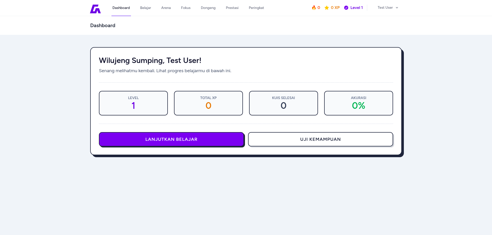

# AksaraQuest



**Tautan Demo:** [https://aksaraquest.anopus.my.id](https://aksaraquest.anopus.my.id)

AksaraQuest adalah platform web berbasis gamifikasi yang dirancang untuk merevitalisasi dan mempopulerkan kembali Aksara Sunda. Melalui pengalaman belajar yang interaktif dan terstruktur, aplikasi ini mengubah proses belajar konvensional menjadi sebuah perjalanan digital yang menarik.

## Filosofi Proyek

Proyek ini dikembangkan sebagai solusi atas kurangnya media pembelajaran digital yang relevan bagi generasi muda dalam mempelajari budaya lokal. Logo aplikasi ini mengadopsi karakter Aksara Sunda "Da", yang melambangkan "Dalan" atau "Jalan", merepresentasikan sebuah proses perjalanan belajar yang berkelanjutan dan terstruktur.

## Fitur Utama

AksaraQuest mengintegrasikan teknologi modern dengan kurikulum budaya untuk menciptakan ekosistem pembelajaran yang komprehensif.

### Fitur Pengguna

**1. Jalur Pembelajaran Terstruktur**
Sistem kurikulum bertingkat yang memandu pengguna dari tingkat dasar hingga mahir. Pelajaran lanjutan terkunci secara otomatis dan hanya dapat diakses setelah pengguna menyelesaikan materi prasyarat.

**2. Sistem Tinjauan Cerdas (Spaced Repetition System)**
Menggunakan algoritma cerdas untuk melacak tingkat penguasaan pengguna terhadap setiap karakter aksara. Sistem secara otomatis menjadwalkan sesi tinjauan ulang pada interval waktu tertentu untuk mengoptimalkan daya ingat jangka panjang.

**3. Arena Kuis Interaktif**
Modul evaluasi yang mencakup empat tipe soal berbeda (Visual ke Teks, Audio ke Teks, Identifikasi Karakter, dan Pilihan Ganda) untuk menguji pemahaman secara menyeluruh.

**4. Mode Dongeng**
Fitur literasi yang menyajikan cerita rakyat Sunda dalam aksara asli. Dilengkapi dengan fitur interaktif di mana pengguna dapat mengklik setiap kata untuk melihat transliterasi Latin, membantu pemahaman konteks bacaan.

**5. Gamifikasi dan Progresi**
* **XP dan Level:** Pengguna mendapatkan poin pengalaman (XP) untuk setiap aktivitas belajar.
* **Streak Harian:** Sistem pelacakan aktivitas harian untuk membangun kebiasaan belajar yang konsisten.
* **Papan Peringkat:** Kompetisi global antar pengguna berdasarkan perolehan XP dan konsistensi belajar.

**6. Sertifikasi Digital**
Sistem ujian akhir yang komprehensif. Pengguna yang lulus dengan nilai di atas ambang batas akan mendapatkan sertifikat digital "Master Aksara Sunda" yang di-generate secara otomatis dalam format PDF/Gambar.

**7. Keamanan Akun**
* Integrasi Google OAuth untuk login cepat dan aman.
* Perlindungan Google reCAPTCHA pada formulir registrasi dan login.
* Verifikasi email wajib untuk pendaftaran akun baru.

### Fitur Administrator

Panel admin lengkap dengan fungsi CRUD (Create, Read, Update, Delete) untuk mengelola seluruh konten aplikasi tanpa perlu mengubah kode program:
* Manajemen Data Aksara (Karakter, Latin, Audio).
* Manajemen Kurikulum (Bab dan Pelajaran).
* Manajemen Bank Soal Kuis.
* Manajemen Konten Dongeng.
* Manajemen Pengguna.

## Teknologi yang Digunakan

* **Backend:** Laravel 12
* **Frontend:** Vue.js 3 (Composition API)
* **Full-stack Adapter:** Inertia.js
* **Database:** MySQL
* **Styling:** Tailwind CSS

## Panduan Instalasi (Windows)

Ikuti langkah-langkah berikut untuk menjalankan proyek ini di lingkungan Windows (menggunakan Laragon, XAMPP, atau terminal manual).

**Prasyarat:**
* PHP >= 8.2
* Composer
* Node.js & NPM
* MySQL

**Langkah Instalasi:**

1.  **Kloning Repositori**
    Buka terminal dan jalankan perintah berikut:
    ```bash
    git clone [https://github.com/haerulyudaaditiya/aksaraquest.git](https://github.com/haerulyudaaditiya/aksaraquest.git)
    ```

2.  **Masuk ke Direktori Proyek**
    ```bash
    cd aksaraquest
    ```

3.  **Instal Dependensi Backend (PHP)**
    ```bash
    composer install
    ```

4.  **Instal Dependensi Frontend (Node.js)**
    ```bash
    npm install
    ```

5.  **Konfigurasi Environment**
    Salin file contoh konfigurasi dan ubah namanya menjadi `.env`:
    ```bash
    copy .env.example .env
    ```
    Buka file `.env` dan sesuaikan konfigurasi berikut:
    * **Database:** Sesuaikan `DB_DATABASE`, `DB_USERNAME`, dan `DB_PASSWORD`.
    * **Google OAuth:** Isi `GOOGLE_CLIENT_ID` dan `GOOGLE_CLIENT_SECRET`.
    * **reCAPTCHA:** Isi `NOCAPTCHA_SITEKEY`, `NOCAPTCHA_SECRET`, dan `VITE_RECAPTCHA_SITE_KEY`.
    * **Email:** Sesuaikan konfigurasi SMTP untuk fitur verifikasi email.

6.  **Generate Key Aplikasi**
    ```bash
    php artisan key:generate
    ```

7.  **Migrasi dan Seeding Database**
    Perintah ini akan membuat tabel dan mengisi data awal (termasuk akun admin default, data aksara, dan soal latihan):
    ```bash
    php artisan migrate:fresh --seed
    ```

8.  **Jalankan Aplikasi**
    Anda perlu menjalankan dua terminal secara bersamaan.

    Terminal 1 (Server Laravel):
    ```bash
    php artisan serve
    ```

    Terminal 2 (Kompilasi Aset Frontend):
    ```bash
    npm run dev
    ```

9.  **Akses Aplikasi**
    Buka browser dan kunjungi `http://localhost:8000`.
